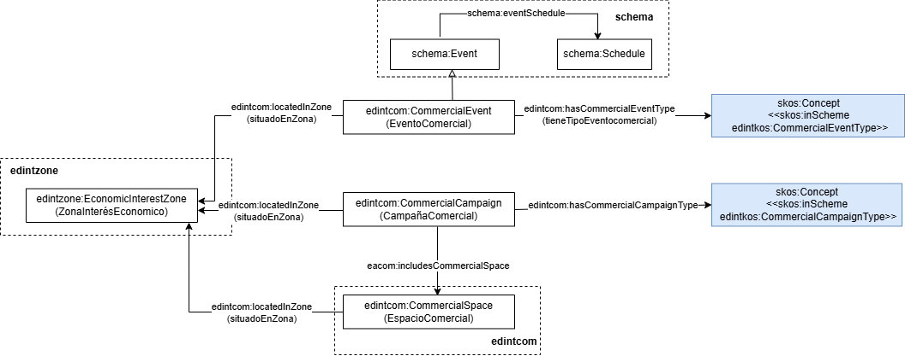

# Ontología EDINT de Promoción Comercial (EDINT Commercial Promotion Ontology)

La ontología de Promoción Comercial representa el dominio de las promociones comerciales, incluyendo eventos y campañas.

# Propósito y alcance de la ontología (Purpose and scope of the ontology)

El propósito de esta ontología es proporcionar un vocabulario común para la representación de las entidades y los datos principales relacionados con la promoción comercial, como campañas y eventos. Quedan fuera del alcance de la ontología otros aspectos relacionados con el comercio, como pueden ser los datos del censo de locales comerciales, que son objeto de una ontología específica dentro del mismo proyecto EDINT.

# Prefijo y espacio de nombres (Prefix and namespace)

El prefijo de la ontología es: edintcom y se encuentra publicada en el espacio de nombres: [http://vocab.linkeddata.es/datosabiertos/def/comercio/promocion#](http://vocab.linkeddata.es/datosabiertos/def/comercio/promocion#)

# Modelo conceptual (Ontology conceptualization)

# Estructura del repositorio (Repository structure)

El repositorio debe contener (al menos) las siguientes carpetas

| Carpeta | Descripción |
|--------|--------------|
| **diagrams/** | Contiene diagramas y otros recursos que representan el modelo conceptual de la ontología (por ejemplo, jerarquías de clases, relaciones). |
| **documentation/** | Contiene la documentación de la ontología y artefactos relacionados en formato HTML o dirigida a usuarios. |
| **tests/** | Contiene las pruebas para la evaluación de la ontología. |
| **kos/** | Contiene la implementación de vocabularios controlados o KOS, generalmente implementaciones SKOS en RDF.|
| **ontology/** | Contiene los archivos de implementación de la ontología en formatos como .owl, .rdf, .ttl o .jsonld |
| **requirements/** | Contiene todos los documentos utilizados para definir los requisitos de la ontología: ejemplos de datos, preguntas de competencia, requisitos funcionales, casos de uso, etc. |
| **shapes/** | Contiene las restricciones SHACL utilizad para validar datos respecto a la ontología.  |

# Mantenimiento y evolución (Maintenance and evolution)

Para manejar las incidencias o mejoras sugeridas con respecto a la ontología, recomendamos seguir las guías proporcionadas en ([Issues Management](./ISSUES.md)) para generar una incidencia.

# Financiación (Funding)

Esta ontología ha sido desarrollada en el contexto del Espacio de Datos para las Infraestructuras Urbanas Inteligentes ([EDINT](https://edint.es)).

